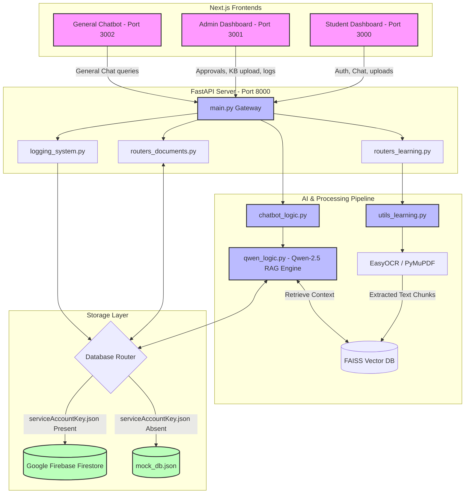

# Campus Support System & Language-Agnostic AI Chatbot

Welcome to the **Campus Support System & Language-Agnostic AI Chatbot** repository. This is an enterprise-grade, multi-service campus management platform designed to automate student services, streamline administrative workflows, and provide multi-turn, multilingual conversational assistance.

The project features a **FastAPI python backend** powering a custom **Qwen-2.5 Retrieval-Augmented Generation (RAG) engine** integrated with **Sentence-Transformers**, **FAISS Vector DB**, **EasyOCR**, and **PyMuPDF**. The frontend comprises three modern, highly interactive **Next.js web applications** for students, administrators, and general campus guests.

---

## 🌟 Key Features

### 1. Multilingual Conversational AI
- **LLM Engine**: Powered by a 4-bit quantized execution of `Qwen/Qwen2.5-1.5B-Instruct` using `bitsandbytes` to run efficiently on consumer GPUs (low VRAM footprint).
- **Fine-Tuned Adapter Support**: Dynamically loads custom LoRA fine-tuning weights from `qwen-college-bot-lora` if present, falling back to the base instructions if not.
- **Multilingual Embeddings**: Uses `sentence-transformers/paraphrase-multilingual-MiniLM-L12-v2` for cross-lingual vector search and query comprehension.
- **Multilingual Support**: Real-time language selector and context detection supporting **English, Hindi (हिंदी), Tamil (தமிழ்), and Telugu (తెలుగు)**.

### 2. Automated Scholarship Vetting
- **Multi-Turn Information Gathering**: Detects when a student queries scholarship eligibility (e.g., *Sona Merit Scholarship*) and automatically initiates an interactive dialog to gather missing academic and financial parameters (CGPA, Department, Year, and Family Income).
- **Automated Vetting Engine**: Matches the student's profile (either from Firestore database or queried on-the-fly) against rules defined in the database (e.g., minimum GPA, maximum family income, eligible departments, and academic years).

### 3. Dynamic Knowledge Ingestion & Parsing
- **Scanned File OCR Pipeline**: Automatically falls back to **EasyOCR** text extraction when **PyMuPDF (fitz)** fails to retrieve native text from scanned documents and images.
- **Intelligent Timetable Grid Parser**: Features a custom-built spatial coordinate algorithm to cluster exam dates, times, and align department-specific schedules into highly structured knowledge chunks.
- **Auto-Rebuilding Index**: Detects changes in the embedding model configuration and rebuilds the FAISS database directory automatically to prevent dimensional mismatch errors.

### 4. Digital Vault & Approvals Panel
- **Student Vault**: Allows students to upload files (e.g., certificates, grade cards) to a local static server, logging records to the database with a **Pending** verification status.
- **Admin Review Queue**: Provides administrators with a dashboard to preview, download, approve, or reject uploaded student credentials. Approved credentials auto-synchronize to update student records.

### 5. Dual-Mode Persistent Database Layer
- **Production Mode**: Integrates with **Google Firebase Firestore** via `firebase-admin` service accounts.
- **Mock Mode**: Falls back to a local JSON-based persistent database (`mock_db.json`) if `serviceAccountKey.json` is missing or `ENABLE_MOCK_DB=true` is set. Features full transactional class emulators for Firestore's collections, documents, streams, and filters.

---

## 📐 System Architecture

### 📂 Directory Structure

```text
Chatbot_LLM/
├── backend/                       # Python FastAPI Backend
│   ├── college_faiss_index/       # Generated FAISS Vector Database index
│   ├── uploaded_knowledge/        # Ingested PDF/DOCX/TXT knowledge sources
│   ├── uploads/                   # Uploaded student certificates & documents
│   ├── main.py                    # API Entrypoint, CORS, Static Serving, Routers
│   ├── database.py                # Dual-mode Firebase / Mock JSON Firestore client
│   ├── qwen_logic.py              # LLM RAG engine, Translation, and Scholarship rules
│   ├── chatbot_logic.py           # Chatbot API routing helper
│   ├── utils_learning.py          # PDF loaders, EasyOCR extraction, Table parser
│   ├── logging_system.py          # Firebase activity logs tracker
│   ├── routers_documents.py       # Endpoints for student document vaults and approvals
│   ├── routers_learning.py        # Endpoints for admin knowledge base ingestion
│   ├── requirements.txt           # Python application dependencies
│   └── verify_system.py           # Local backend testing script
├── student-dashboard/             # Student Next.js Web App (Port 3000)
│   ├── app/
│   │   ├── dashboard/             # Private Student pages (Widgets, Chat, Digital Vault)
│   │   ├── LanguageContext.js     # Multilingual state controller
│   │   ├── globals.css            # Custom CSS system (Aesthetics & Animations)
│   │   ├── layout.js              # Theme and structural wrapper
│   │   └── page.js                # Student login portal
├── admin-dashboard/               # Admin Next.js Web App (Port 3001)
│   ├── app/
│   │   ├── dashboard/             # Admin console (Approvals, Learning, logs)
│   │   ├── globals.css            # Dark mode system stylesheet
│   │   └── page.js                # Admin gateway
├── general-chatbot/               # Public Visitor Next.js Web App (Port 3002)
│   ├── app/
│   │   ├── globals.css            # Chat panel design
│   │   └── page.js                # Public chat interface
├── run_project.bat                # Orchestration script to run all services locally
└── mock_db.json                   # Auto-generated local fallback database file
```

### 🔄 Data & Execution Flow Diagram



---

## 🛠️ Backend Subsystem Deep-Dive

### 💾 Dual-Mode Database Wrapper ([database.py](file:///d:/Chatbot_LLM/backend/database.py))
The database module is engineered to operate without external dependencies during development. It exposes a unified client object `db` representing a Firestore-like API:
- **Fallback Logic**: Checks for the existence of `serviceAccountKey.json` and environmental overrides (`ENABLE_MOCK_DB`).
- **Mock Implementation**: Emulates Firestore classes including:
  - `MockCollection`: Provides `.add()`, `.document()`, `.where()`, and `.stream()` features.
  - `MockDocRef` & `MockDoc`: Emulates `.get()`, `.set()`, `.update()`, and exposes `.to_dict()` and `.exists`.
  - **State Persistence**: Serializes dates to ISO strings and auto-updates the JSON workspace storage at [mock_db.json](file:///d:/Chatbot_LLM/mock_db.json).

### 🤖 LLM & Multilingual RAG Engine ([qwen_logic.py](file:///d:/Chatbot_LLM/backend/qwen_logic.py))
Responsible for model execution and cognitive workflows:
- **Quantization**: Imports the Hugging Face model and wraps it in a 4-bit configuration using `BitsAndBytesConfig`:
  ```python
  bnb_config = BitsAndBytesConfig(
      load_in_4bit=True,
      bnb_4bit_use_double_quant=True,
      bnb_4bit_quant_type="nf4",
      bnb_4bit_compute_dtype=torch.bfloat16
  )
  ```
- **Context Retrieval**: When a query is received, the sentence embeddings of the query are checked against the FAISS index to retrieve the top 3 corresponding text chunks (`k=3`), which are formatted and added to the prompt context.
- **Interactive Vetting State Machine**: If the query is related to scholarships, the bot compares the current user's profile metadata in the DB. For fields containing `None`, it inserts a conversational state marker (`scholarship_check`) in the user's session context and prompts the user to supply the missing parameter. Once gathered, eligibility is verified and returned.

### 📝 OCR & Schedule Table Parser ([utils_learning.py](file:///d:/Chatbot_LLM/backend/utils_learning.py))
The ingestion pipeline converts complex document layouts into search-friendly text:
1. **PyMuPDF Extraction**: Tries to pull clean Unicode text directly from PDFs.
2. **EasyOCR Fallback**: If zero text is returned (e.g., scanned images), it renders each page as a 150 DPI image block and feeds it to `easyocr.Reader(['en', 'hi'])`.
3. **Table & Grid Alignment**: 
   - Uses bounding box (`bbox`) spatial coordinates to detect calendar/timetable indicators.
   - Groups text blocks on the horizontal axis to align columns (detects columns by clustering time headers, e.g., `10:00 am - 1:00 pm`).
   - Aligns rows vertically using known department sequences (`CSE`, `ECE`, `MECH`, etc.), mapping dates and times to specific branches, solving the standard grid overlap issue typical in linear OCR scripts.

---

## 🎨 Frontend Portals Deep-Dive

All interfaces are built using **Next.js** (App Router) combined with **Vanilla CSS Variables** (for theme scaling, premium dark configurations, and glassmorphism) and animated with **Framer Motion**.

### 1. Student Dashboard (Port 3000)
- **Login Portal**: Authenticates student credentials (`admission_no` and `dob`) against the database.
- **Weekly Dashboard**: Displays interactive progress indicators (attendance tracker, assignment progress, laboratory session charts).
- **Multilingual Support**: Employs a custom React context (`LanguageContext.js`) loaded with localization keys for a seamless localized UI.
- **Secure Vault**: File inputs linked to `/api/documents/upload/{student_id}` dynamically refresh student vaults.

### 2. Admin Dashboard (Port 3001)
- **Document Approvals**: Display table summarizing all uploaded files workspace-wide with inline preview options, PDF downloads, and `Approve` / `Reject` buttons.
- **Ingestion Center**: Ingests new knowledge sheets. Shows current chunk counts and lists trained files.
- **Log Monitor**: Lists full student-bot interactions and actions in a sorted grid.

### 3. General Chatbot (Port 3002)
- Simple visitor page configured to talk directly to `/api/chat/general` without requiring authentication cookies.

---

## 📊 Database Schema (JSON Representation)

Below are the mock schemas mapped in both **Firebase Firestore** collections and [mock_db.json](file:///d:/Chatbot_LLM/mock_db.json):

### 1. `students` (Collection)
Contains student profiles and credentials:
```json
{
  "2023CS001": {
    "name": "Student Demo",
    "admission_no": "2023CS001",
    "dob": "2000-01-01",
    "cgpa": 9.2,
    "department": "CSE",
    "year": 3,
    "family_income": 250000.0
  }
}
```

### 2. `scholarships` (Collection)
Rules and parameters for vetting student eligibility:
```json
{
  "sona_merit": {
    "id": "sona_merit",
    "scholarship_name": "Sona Merit Scholarship",
    "min_gpa": 8.5,
    "max_income": 300000.0,
    "eligible_departments": ["CSE", "ECE", "IT"],
    "eligible_years": [2, 3, 4]
  }
}
```

### 3. `documents` (Collection)
Keeps track of files uploaded to the student's digital vault:
```json
{
  "doc_uuid_123": {
    "student_id": "2023CS001",
    "title": "Semester_1_MarkSheet.pdf",
    "file_path": "/uploads/Semester_1_MarkSheet.pdf",
    "status": "Pending",
    "upload_date": "2026-07-17T18:00:00Z"
  }
}
```

### 4. `activity_logs` (Collection)
Audit trails of all requests:
```json
{
  "log_uuid_456": {
    "user_id": "2023CS001",
    "action_type": "CHAT",
    "details": "Query: Tell me about Sona College | Response: Sona College of Technology is located in...",
    "timestamp": "2026-07-17T18:05:00Z"
  }
}
```

---

## 🚀 Setup & Execution Guide

### Prerequisites
- **Python**: v3.10 or higher.
- **Node.js**: v18.0 or higher.
- **CUDA Toolkit** (Optional): Highly recommended for accelerating local LLM inference.

### Setup Backend
1. Open a terminal in the `backend` directory.
2. Create and activate a python virtual environment:
   ```bash
   cd backend
   python -m venv venv
   # On Windows:
   venv\Scripts\activate
   # On Unix/macOS:
   source venv/bin/activate
   ```
3. Install required packages:
   ```bash
   pip install -r requirements.txt
   ```
4. (Optional) For production setup, place your Firebase admin key JSON in `backend/serviceAccountKey.json`. If left out, the server automatically defaults to `mock_db.json`.

### Setup Frontends
Run the package installations for each directory:
```bash
# Student Dashboard
cd student-dashboard
npm install

# Admin Dashboard
cd ../admin-dashboard
npm install

# General Chatbot
cd ../general-chatbot
npm install
```

### Running the Project
Use the provided batch script to launch the backend and all Next.js applications in parallel command consoles:
```bash
# From the root directory:
run_project.bat
```
*Alternatively, run each command individually in separate terminals:*
- **Backend API**: `uvicorn main:app --reload --port 8000` (from `backend` with venv active)
- **Student Dashboard**: `npm run dev -- -p 3000` (from `student-dashboard`)
- **Admin Dashboard**: `npm run dev -- -p 3001` (from `admin-dashboard`)
- **General Chatbot**: `npm run dev -- -p 3002` (from `general-chatbot`)

---

## 🧪 Testing the APIs
You can perform a quick validation check of your running backend utilizing [verify_system.py](file:///d:/Chatbot_LLM/backend/verify_system.py):
```bash
cd backend
venv\Scripts\activate
python verify_system.py
```
This script tests:
1. Student Chatbot routing `/api/chat/student`.
2. Digital Vault upload routing `/api/documents/upload/{student_id}` with a mock PDF generator.
